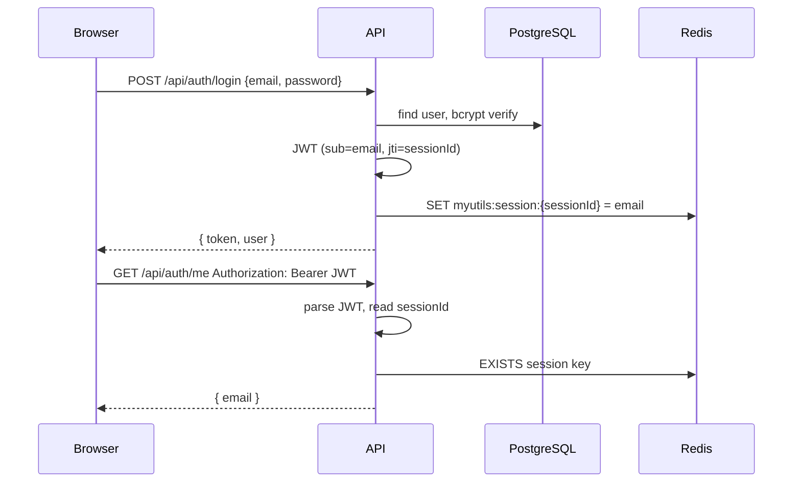
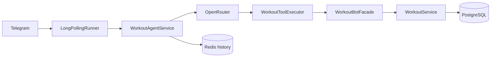

# my-utils-api — архитектура бекенда

Подробное описание того, как устроен API, где что хранится и как связаны веб, Telegram-бот и Temporal.

---

## Стек

| Слой | Технология |
|------|------------|
| Язык | Kotlin 2.1, JVM 21 |
| Фреймворк | Spring Boot 3.4 |
| HTTP | Spring Web (REST) |
| Безопасность | Spring Security + JWT (jjwt) |
| БД | PostgreSQL 16, JPA/Hibernate, Flyway |
| Кэш / сессии / история чата | Redis 7 |
| Оркестрация | Temporal 1.30 (`temporal-spring-boot-starter`) |
| LLM | OpenRouter API (Claude 3.5 Haiku) |
| Telegram | Long polling (`getUpdates`), без webhook |
| Сборка | Gradle 9.4, Docker (`gradle:9.4.1-jdk21` в Dockerfile) |

Репозиторий: `https://github.com/alexey-va/my-utils-api`  
Фронт: `my-utils` (Vite + React), ходит на `/api/*`.

---

## Деплой и контейнеры

```text
docker compose up -d --build
```

| Сервис | Назначение | Порт (локально) |
|--------|------------|-----------------|
| `api` | Spring Boot JAR | 8080 |
| `postgres` | Данные приложения | 5432 |
| `redis` | Сессии JWT + история Telegram | 6379 |
| `temporal` | Temporal Server | 7233 (gRPC) |
| `temporal-postgresql` | Служебная БД Temporal | внутренний |
| `temporal-ui` | Веб-UI Temporal | 8233 |

**Jenkins** (`jenkins-deploy.sh` + `docker-compose.jenkins.yml`):

- API на `127.0.0.1:18080`, Postgres `15432`, Redis `16379`, Temporal `17233`, UI `18233`
- Секреты: `TELEGRAM_BOT_TOKEN`, `OPENROUTER_API_KEY` из Jenkins Credentials
- Прокси для Telegram/OpenRouter: `185.242.106.81:8888`
- Temporal workers: `MYUTILS_TEMPORAL_ENABLED=true`, вечернее напоминание включено

Конфиг: `application.yml` + `.env` (опционально, `spring.config.import`).

---

## Структура кода

```text
dev.myutils.api/
├── web/              REST-контроллеры, DTO, обработка ошибок
├── security/         JWT, фильтр, SecurityConfig
├── session/          Redis-сессии после логина
├── service/          Бизнес-логика (workout, auth)
├── domain/           JPA-сущности и репозитории
├── agent/            OpenRouter-агент и tools
├── telegram/         Клиент Telegram, long polling, история в Redis
├── openrouter/       HTTP-клиент к OpenRouter
├── temporal/         Workflows, activities, старт напоминаний
├── http/             Общий HTTP proxy для исходящих запросов
└── config/           Properties, CORS, условные бины (@ConditionalOnTelegramBot)
```

Миграции: `src/main/resources/db/migration/V*.sql` (Flyway, только вперёд).

---

## База данных (PostgreSQL)

### Таблицы

**`users`** — учётные записи для веб-логина (email + bcrypt hash).

**`exercises`** — справочник упражнений пользователя.

- `user_id` → владелец
- `name` — уникально в рамках пользователя
- `muscle_group` — `chest`, `back`, `legs`, `shoulders`, `arms`, `core`, `other` (с V2)

**`workout_entries`** — одна ячейка дневника: упражнение + дата + параметры.

| Поле | Смысл |
|------|--------|
| `performed_on` | Дата тренировки (DATE) |
| `weight_kg` | Вес (кг), полный (штанга + блины) |
| `set_count` | Число рабочих подходов (обычно 3) |
| `reps_per_set` | Повторы в подходах 1–3 (X) |
| `max_reps` | Повторы в 4-м подходе «на максимум» (МАХ) |

Уникальность: `(user_id, exercise_id, performed_on)` — одна запись на упражнение в день.

Формат в боте и UI: **`вес 3*X/МАХ`** → `weight_kg`, `set_count=3`, `reps_per_set=X`, `max_reps=МАХ`.

### Пользователь дневника

Все операции с тренировками идут от фиксированного пользователя **`local@workout`** (`WorkoutService.LOCAL_WORKOUT_EMAIL`). Это один общий дневник для веба и Telegram; отдельной привязки «Telegram user → DB user» пока нет.

Сиды:

- `V1__init.sql` — демо-данные
- `V3__real_workout_data.sql` — реальный журнал (перезаписывает demo для `local@workout`)

---

## Redis

| Ключ | Префикс | TTL | Содержимое |
|------|---------|-----|------------|
| Сессия JWT | `myutils:session:{sessionId}` | 24 ч (как JWT) | email пользователя |
| История чата бота | `myutils:telegram:chat:{chatId}` | 48 ч | JSON массив сообщений OpenRouter |

Сессия **обязательна**: даже валидный JWT без записи в Redis → 401 на `/api/auth/*`.

---

## Авторизация (веб)

Схема: **stateless JWT + server-side session в Redis** (гибрид).



### Эндпоинты auth

| Метод | Путь | Доступ | Описание |
|-------|------|--------|----------|
| POST | `/api/auth/login` | публичный | Логин, выдача JWT |
| POST | `/api/auth/logout` | JWT + Redis | Удаление сессии в Redis |
| GET | `/api/auth/me` | JWT + Redis | Текущий email |

### SecurityConfig (важно)

| Путь | Правило |
|------|---------|
| `GET /api/health` | без авторизации |
| `POST /api/auth/login` | без авторизации |
| `/api/workouts/**` | **без авторизации** (permitAll) |
| `/api/auth/**` (кроме login) | JWT обязателен |
| всё остальное | запрещено (denyAll) |

То есть **дневник тренировок сейчас открыт без токена** — осознанное упрощение для личного инстанса. Админка/профиль через `/api/auth/me` защищены.

JWT:

- Подпись: `myutils.jwt.secret` (HS256)
- В `jti` хранится `sessionId` (UUID)
- В `sub` — email

---

## REST API тренировок

Базовый префикс: **`/api/workouts`**.

| Метод | Путь | Действие |
|-------|------|----------|
| GET | `/exercises` | Список упражнений |
| POST | `/exercises` | Создать упражнение |
| PATCH | `/exercises/{id}` | Переименовать / сменить группу мышц |
| DELETE | `/exercises/{id}` | Удалить упражнение |
| GET | `/exercises/{id}/progress` | Прогресс по упражнению |
| GET | `/grid` | Матрица дат × упражнения для UI |
| POST | `/entries` | Upsert записи за день |
| DELETE | `/exercises/{exerciseId}/entries/{date}` | Удалить запись за день |

`WorkoutService` пишет в лог `source=api` или `source=telegram-bot` при изменениях из бота.

---

## Telegram-бот

Включается только если задан **`TELEGRAM_BOT_TOKEN`** (`@ConditionalOnTelegramBot`).

### Как приходят сообщения

**Long polling** — приложение само опрашивает `https://api.telegram.org/bot{token}/getUpdates` с `timeout=30` (долгое ожидание, не «раз в 30 секунд»). Webhook не используется.

При старте: `deleteWebhook` на стороне Telegram, чтобы не было конфликта режимов.

```text
TelegramLongPollingRunner (virtual thread)
  → getUpdates
  → WorkoutAgentService.handleUpdateAsync (@Async)
```

### Доступ

`TELEGRAM_ALLOWED_USER_IDS` — список numeric user id через запятую. Пусто = все (не рекомендуется в проде).

### Обработка сообщения

1. Фильтр по `userId`
2. `/start` — приветствие без LLM
3. Иначе: `typing` → загрузка истории из Redis → **агент** → ответ в Telegram → сохранение истории (до 24 сообщений)

### OpenRouter-агент

Каждое сообщение пользователя:

```text
[system] статический промпт тренера
[system] снимок дневника (WorkoutAgentContextBuilder → WorkoutBotFacade)
[...] история из Redis
[user] текущий текст
```

Цикл до `max-tool-iterations` (8):

1. `OpenRouterClient.chat` с tools
2. Если есть `tool_calls` → `WorkoutToolExecutor` → результаты в контекст
3. После `log_workout` / `delete_workout` / `create_exercise` / `rename_exercise` — **снимок пересобирается**
4. Если нет tools — финальный текст пользователю

**Снимок дневника** (не в Redis, каждый раз заново):

- что сделано на этой неделе / что не делали
- баланс групп мышц
- последняя сессия по каждому упражнению
- сегодня / вчера

Часовой пояс снимка: runtime-настройка `temporal.zone-id` (по умолчанию Europe/Moscow).

### Tools агента

| Tool | Назначение |
|------|------------|
| `list_exercises` | Список упражнений |
| `create_exercise` | Новое упражнение |
| `rename_exercise` | Переименование |
| `log_workout` | Запись/обновление за день |
| `delete_workout` | Удаление за день |
| `get_exercise_progress` | Прогресс, если мало в снимке |
| `get_day_summary` | День, если мало в снимке |
| `send_notification` | Сразу сообщение в чат (Temporal) * |
| `schedule_notification` | Отложенное сообщение * |
| `cancel_notification` | Отмена по `workflow_id` * |

\* Только если `myutils.temporal.enabled=true`.

### Исходящий HTTP

Telegram API и OpenRouter при необходимости идут через **HTTP proxy** (`OPENROUTER_PROXY_*` — общий флаг для обоих клиентов).

---

## Temporal

Включается: `MYUTILS_TEMPORAL_ENABLED=true`, адрес `TEMPORAL_TARGET` (в Docker: `temporal:7233`).

Очередь задач: **`myutils-main`**.  
Workers поднимаются Spring Boot autoconfig (`workers-auto-discovery` → пакет `dev.myutils.api.temporal`).

**Важно:** для Kotlin workflow-аргументов зарегистрирован `TemporalDataConverterConfiguration` с `jacksonObjectMapper()`, иначе Temporal не десериализует `data class`.

### Workflows

#### 1. `EveningWorkoutReminderWorkflow` (долгоживущий)

- **ID:** `evening-reminder-{chatId}`
- Стартует при подъёме API, если `temporal.evening-reminder.enabled=true` в `app_settings` и есть Telegram
- Час/минута/zone — из runtime settings (`temporal.evening-reminder.*`, `temporal.zone-id`)
- Цикл: sleep до заданного времени → activity «есть ли записи сегодня?» → если нет — сообщение в Telegram

#### 2. `TelegramNotificationWorkflow` (одноразовый)

- **ID:** `tg-notify-{chatId}-{uuid}`
- Sleep до `deliver_at` → `TelegramActivities.sendMessage`
- Запускается из tools `send_notification` / `schedule_notification`

### Activities

| Activity | Реализация |
|----------|------------|
| `WorkoutReminderActivities` | Проверка дневника, вечерний текст |
| `TelegramActivities` | Отправка любого текста в чат |

### Слои вызова

```text
Агент (tool) → TemporalNotificationFacade → TemporalWorkflowService → Temporal Server
                                                      ↓
                                            Worker выполняет Workflow → Activity → TelegramClient
```

---

## Поток данных: запись из Telegram



Запись в БД та же, что из веба: один пользователь `local@workout`, те же таблицы.

---

## Runtime properties (`app_settings`)

Свойства (`Property`), меняемые без рестарта. Все определения — в одном файле `properties/Properties.kt` (реестр `AppProperties`). Сервис: `RuntimePropertiesService`.

| Ключ | Тип | Назначение |
|------|-----|------------|
| `temporal.evening-reminder.enabled` | bool | Вечерний workflow |
| `temporal.evening-reminder.hour` | int | Час (0–23) |
| `temporal.evening-reminder.minute` | int | Минута (0–59) |
| `temporal.zone-id` | string | Часовой пояс снимка и Temporal |
| `openrouter.model` | string | Модель агента |
| `openrouter.max-tool-iterations` | int | Лимит tool-calling |
| `telegram.conversation-ttl-hours` | int | TTL истории в Redis |

**Admin API** (JWT): `GET/PUT /api/admin/settings`, `GET/PUT /api/admin/settings/{key}`.

При `PUT` связанных temporal-свойств вызывается `onApplied` на `Property` (без отдельных listener-классов) — старт/отмена evening workflows.

Кэш перезагружается из БД **каждую минуту**. При ошибке парсинга — **лог** и **default** из определения `Property`.

---

## Переменные окружения (основные)

| Переменная | Назначение |
|------------|------------|
| `POSTGRES_*` | Подключение к БД приложения |
| `REDIS_HOST`, `REDIS_PORT` | Redis |
| `TELEGRAM_BOT_TOKEN` | Бот (пусто = бот выключен) |
| `TELEGRAM_ALLOWED_USER_IDS` | Кто может писать боту |
| `OPENROUTER_API_KEY` | Ключ LLM |
| `OPENROUTER_PROXY_ENABLED/HOST/PORT` | Прокси |
| `MYUTILS_TEMPORAL_ENABLED` | Workers Temporal |
| `TEMPORAL_TARGET` | gRPC Temporal |
| `MYUTILS_CORS_ALLOWED_ORIGINS` | CORS для фронта |

Полный пример: `.env.example`.

---

## Локальная разработка

```bash
# только инфра
docker compose -f docker-compose.dev.yml up -d

# API на хосте
cp .env.example .env   # заполнить токены
./gradlew bootRun
```

Полный стек с Temporal UI:

```bash
DOCKER_BUILDKIT=1 docker compose up -d --build
```

Тесты: `./gradlew test` (нужны Postgres + Redis; Temporal — in-process test server в профиле `test`).

---

## Что почитать в коде дальше

| Тема | Файл |
|------|------|
| Правила доступа HTTP | `security/SecurityConfig.kt` |
| Логин / сессия | `service/AuthService.kt`, `session/SessionService.kt` |
| Матрица и записи | `service/WorkoutService.kt` |
| Промпт и цикл агента | `agent/WorkoutAgentService.kt` |
| Снимок для LLM | `service/WorkoutAgentSnapshotFormatter.kt` |
| Старт polling | `telegram/TelegramLongPollingRunner.kt` |
| Temporal старт | `temporal/TemporalWorkflowService.kt` |

Краткая шпаргалка для агентов: `AGENTS.md` в корне репозитория.
